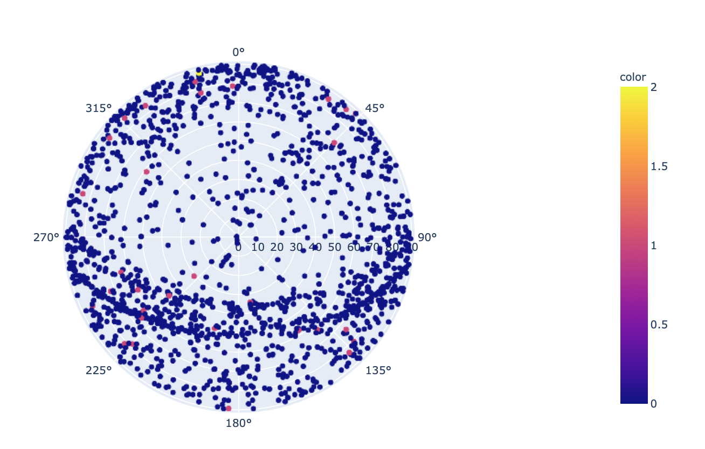

# Welcome to Jacobs Vault (needs a better name)!
> Vault finds overlaps/gaps between AIS shipping tracks and satellite orbits. [Insert logo here.]


**Important**: Insert any version, installation, pre-req, or dietary warnings here.
* Fix these icons - second row is _fastai_, not us!

 

# [](https://pypi.org/project/fastai/#description) [](https://anaconda.org/fastai/fastai) [](https://github.com/fastai/docker-containers) 

## Installing

**GOAL:** You can use jacobs-vault without any installation by using [Google Colab](https://colab.research.google.com/). In fact, every page of this documentation is also available as an interactive notebook - click "Open in colab" at the top of any page to open it. See the documentation on [FIX FIX FIX](https://NotDone/start_colab) for more information.

**GOAL:**
You can install jacobs-vault on your own machines with conda (highly recommended). If you're using [Anaconda](https://www.anaconda.com/products/individual) then run:
```bash
conda install -c <CONDA CHANNEL> jacobs-vault gh anaconda
```

**GOAL:**
...or if you're using [miniconda](https://docs.conda.io/en/latest/miniconda.html)) then run:
```bash
conda install -c fastai -c pytorch fastai
```

**GOAL:**
To install with pip, use: `pip install fastai`. If you install with pip, you should install PyTorch first by following the PyTorch [installation instructions](https://pytorch.org/get-started/locally/).

If you plan to develop ...

``` 
git clone https://github.com/cmorris-jacobs/jacobs-vault
pip install -e "jacobs-vault[dev]"
``` 

## About jacobs-vault

jacobs-vault is organized around an efficient partition of the data to support either distributed Spark/Dash workflows, or fast single-ship satellite queries. 

* ETL process
* approach
* libraries
* queries
* tips




## Tests

Everything below needs to be updated for our dependencies etc. 

To run the tests in parallel, launch:

`nbdev_test_nbs` or `make test`

For all the tests to pass, you'll need to install the following optional dependencies:

```
pip install "sentencepiece<0.1.90" wandb tensorboard albumentations pydicom opencv-python scikit-image pyarrow kornia \
    catalyst captum neptune-cli
```

Tests are written using `nbdev`, for example see the documentation for `test_eq`.

## Contributing

After you clone this repository, please run `nbdev_install_git_hooks` in your terminal. This sets up git hooks, which clean up the notebooks to remove the extraneous stuff stored in the notebooks (e.g. which cells you ran) which causes unnecessary merge conflicts.

Before submitting a PR, check that the local library and notebooks match. The script `nbdev_diff_nbs` can let you know if there is a difference between the local library and the notebooks.

- If you made a change to the notebooks in one of the exported cells, you can export it to the library with `nbdev_build_lib` or `make fastai`.
- If you made a change to the library, you can export it back to the notebooks with `nbdev_update_lib`.

## Docker Containers

For those interested in official docker containers for this project, they can be found [here](https://github.com/fastai/docker-containers#fastai).
